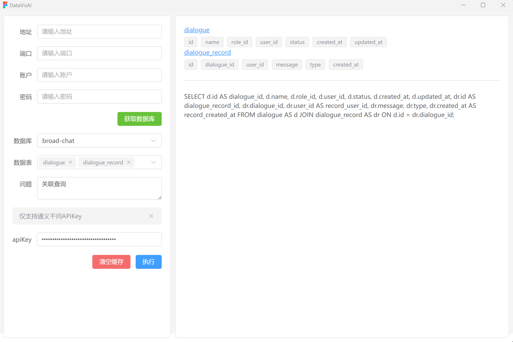

# README

## About

This is the official Wails Vue-TS template.

You can configure the project by editing `wails.json`. More information about the project settings can be found
here: https://wails.io/docs/reference/project-config

## 预览

